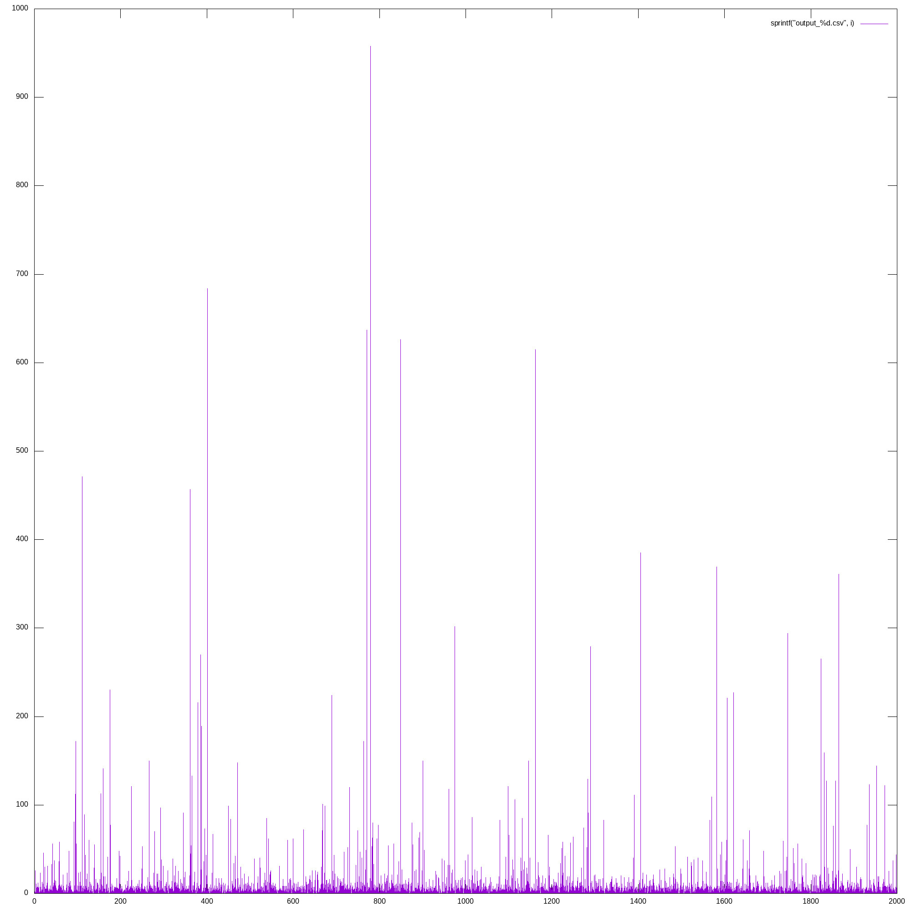

# Исследование распределения различных хэш-функций

##Распределение значений хэш-функции:
```cpp
	unsigned int hash1 (const char* a) {
        return 1;
    }
```


```cpp
unsigned int hash2 (const char* a) {
        return strlen(a);
    }
```


```cpp
unsigned int hash3 (const char* a) {
        int res = 0;
        for (int i = 0; a[i] != 0; i++) {
            res += a[i];
        }
        return res;
    }
```


    unsigned int hash4(const char* a) {
        return hash3(a) * hash2(a);
    }


    unsigned int hash5(const char* a) {
        int tmp = 0;
        int res = 0;
        for (int i = 0; a[i] != 0; i++) {
            res ^= a[i];
            tmp = (res >> 31) & 1;
            res <<= 1;
            res |= tmp;
        }
        return res;
    }


    unsigned int hash6(const char* a) {
        int res = 0;
        for (int i = 0; a[i] != 0; i++) {
            res += a[i] * (i + 1412313);
        }
        return res;
    }



    unsigned int hash7(const char* a) {
        std::hash<const char*> f;
        return (f(a) >> 4);
    }


 ## Дальнейшие измерения провоились с функцией xor+rot hash

 Измерим время работы и прогоним через profiler:

 #### Без оптимизации, на asm (-0O):

 

 Мы видим, что основное процессорное время занимает поиск по списку и вычисление хэша. Оптимизируем их, переписав на ассемблер. Измерим новое время работы. Подключать будем внешний файл на ассемблере. 

 #### С ассемблерной оптимизацией (4053f3 - find, 4053e0 - hash):
 


Время работы:

with    asm (-O0):    28.2 sec

without asm (-O0):    34.2 sec

without asm (-O3):    23 sec

Улучшили время работы на 17.5%

Но все равно проигрываем -O3 на те же 17.5%. Для улучшения результата можно переписать strcmp на asm.